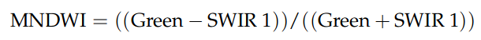

# Special Topics in Remote Sensing

## Nurefşan DEMİR 010160620

### Inputs
- Landsat-8 OLI Satellite Image Band 3 (Green Band)
- Landsat-8 OLI Satellite Image Band 6 (SWIR1 Band)

### Index Used
- Modified Normalized Difference Water Index (MNDWI)

For the enhancement of open water features, MNDWI uses Green and SWIR bands. It also reduces built-up area characteristics in other indices that are frequently associated with open water. The formula for MNDWI is shown below.

### Outputs
- mdwi_620

### Libraries Used in Jupyter Notebook
- rasterio (1.1.0)
- numpy (1.19.2)
- matplotlib (3.3.2)
- notebook (6.1.6)

### References
- Xu, H. "Modification of Normalised Difference Water Index (NDWI) to Enhance Open Water Features in Remotely Sensed Imagery." International Journal of Remote Sensing 27, No. 14 (2006): 3025-3033." (ESRI, 2018)
- https://www.hatarilabs.com/ih-en/ndvi-calculation-from-landsat8-images-with-python-3-and-rasterio-tutorial

